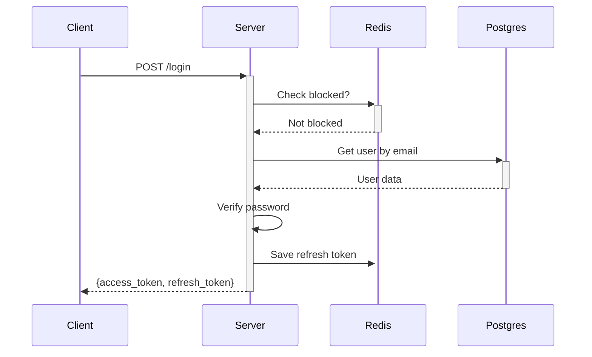

# 🚀 Kế Hoạch 7 Ngày: Xây Dựng Auth System với Golang

> **Mục tiêu**: Xây dựng hệ thống Authentication hoàn chỉnh từ zero, phù hợp cho người mới bắt đầu với Golang.

---

## 📋 Tech Stack (Đã Chọn Sẵn)

| Component | Công nghệ | Lý do chọn |
|-----------|-----------|------------|
| **Web Framework** | Gin | Dễ học, docs tốt, cộng đồng lớn |
| **Database** | PostgreSQL | Standard SQL, free, enterprise-ready |
| **Cache/Session** | Redis | Nhanh, đơn giản, chuẩn công nghiệp |
| **Password Hash** | Bcrypt | Đủ bảo mật, dễ dùng hơn Argon2 |
| **Token** | JWT | Stateless, dễ debug |
| **Container** | Docker Compose | Không cần cài riêng DB |
| **Migration** | golang-migrate | Phổ biến, dễ dùng |
| **Architecture** | Clean/Layer | Dễ hiểu cho người mới |

---

## 🏗️ Kiến Trúc Tổng Quan

```
┌─────────────────────────────────────────────────────────┐
│                    CLIENT (Postman/curl)                │
└─────────────────────┬───────────────────────────────────┘
                      │ HTTP Request
                      ▼
┌─────────────────────────────────────────────────────────┐
│                   AUTH-SERVICE (Gin)                    │
│  ┌─────────────┐  ┌─────────────┐  ┌─────────────┐      │
│  │  Handler    │→ │  Service    │→ │ Repository  │      │
│  │ (Routes)    │  │ (Logic)     │  │ (Database)  │      │
│  └─────────────┘  └─────────────┘  └─────────────┘      │
└─────────────────────┬───────────────┬───────────────────┘
                      │               │
              ┌───────▼───────┐ ┌─────▼─────┐
              │  PostgreSQL   │ │   Redis   │
              │  (Users)      │ │ (Sessions)│
              └───────────────┘ └───────────┘
```

---

## 📁 Cấu Trúc Thư Mục (Target)

```
login/
├── cmd/
│   └── server/
│       └── main.go           # Entry point
├── internal/
│   ├── config/
│   │   └── config.go         # Load env config
│   ├── handler/
│   │   ├── auth.go           # Auth routes
│   │   └── middleware.go     # JWT middleware
│   ├── service/
│   │   ├── auth.go           # Business logic
│   │   └── token.go          # JWT logic
│   ├── repository/
│   │   ├── user.go           # User CRUD
│   │   └── session.go        # Redis session
│   ├── model/
│   │   └── user.go           # User struct
│   └── pkg/
│       ├── password/
│       │   └── bcrypt.go     # Hash/Verify
│       └── validator/
│           └── validator.go  # Input validation
├── migrations/
│   └── 001_create_users.up.sql
├── docker-compose.yml
├── .env
├── go.mod
└── README.md
```

---

# 📅 KẾ HOẠCH CHI TIẾT TỪNG NGÀY

---

## 🟢 DAY 1: Setup & Chạy Được Server

### 🎯 Goal
Server Gin chạy được trong Docker, có endpoint `/health` trả về `200 OK`.

### 📥 Input
- Máy đã cài Docker Desktop
- VS Code + Go extension
- Terminal (PowerShell/CMD)

### 📤 Output
- `docker-compose up` → 3 container chạy (server, postgres, redis)
- `curl localhost:8080/health` → `{"status": "ok"}`
- Go module khởi tạo xong

### 🏛️ Kiến Trúc Hôm Nay
```
┌────────────────┐
│  docker-compose│
│  ├── auth-svc  │ → Port 8080
│  ├── postgres  │ → Port 5432
│  └── redis     │ → Port 6379
└────────────────┘
```

### 💡 Gợi Ý Cách Làm

**Bước 1: Khởi tạo Go module**
```bash
cd d:\golang\login
go mod init github.com/yourname/login
```

**Bước 2: Tạo `cmd/server/main.go`**
```go
package main

import (
    "github.com/gin-gonic/gin"
)

func main() {
    r := gin.Default()
    
    r.GET("/health", func(c *gin.Context) {
        c.JSON(200, gin.H{"status": "ok"})
    })
    
    r.Run(":8080")
}
```

**Bước 3: Tạo `docker-compose.yml`**
```yaml
version: '3.8'
services:
  auth-service:
    build: .
    ports:
      - "8080:8080"
    depends_on:
      - postgres
      - redis
    environment:
      - DB_HOST=postgres
      - REDIS_HOST=redis

  postgres:
    image: postgres:15-alpine
    environment:
      POSTGRES_USER: auth
      POSTGRES_PASSWORD: secret
      POSTGRES_DB: authdb
    ports:
      - "5432:5432"
    volumes:
      - pgdata:/var/lib/postgresql/data

  redis:
    image: redis:7-alpine
    ports:
      - "6379:6379"

volumes:
  pgdata:
```

**Bước 4: Tạo `Dockerfile`**
```dockerfile
FROM golang:1.21-alpine
WORKDIR /app
COPY go.mod go.sum ./
RUN go mod download
COPY . .
RUN go build -o main ./cmd/server
CMD ["./main"]
```

### ❓ Tại Sao Làm Vậy?
| Quyết định | Lý do |
|------------|-------|
| Docker Compose | Không cần cài PostgreSQL/Redis lên máy, ai clone về cũng chạy được |
| Gin framework | 1 file `main.go` đã có server, quá đơn giản |
| `/health` endpoint | Chuẩn DevOps, dùng để check server còn sống không |
| Alpine images | Nhẹ, build nhanh |

### ⬅️ Liên Quan Step Trước
- **Không có** (Day 1 là nền móng)

### ✅ Thêm Được Gì?
- [x] Hiểu cách Go project structure
- [x] Docker không còn đáng sợ
- [x] Có sẵn infra để làm tiếp

### 📝 Checklist Hoàn Thành
- [ ] `go mod init` thành công
- [ ] `docker-compose up` không lỗi
- [ ] `curl localhost:8080/health` trả 200
- [ ] Hiểu được 3 container đang làm gì

---

## 🟢 DAY 2: Database & User Model

### 🎯 Goal
Tạo bảng `users` trong PostgreSQL, viết code CRUD user cơ bản.

### 📥 Input
- Docker đang chạy từ Day 1
- Hiểu cơ bản SQL

### 📤 Output
- Bảng `users` tồn tại trong DB
- Code có thể tạo user mới
- Code có thể tìm user theo email

### 🏛️ Kiến Trúc Hôm Nay
```
┌──────────────┐    ┌──────────────┐    ┌──────────────┐
│   Handler    │───▶│  Repository  │───▶│  PostgreSQL  │
│              │    │  user.go     │    │  users table │
└──────────────┘    └──────────────┘    └──────────────┘
```

### 💡 Gợi Ý Cách Làm

**Bước 1: Cài migration tool**
```bash
go install -tags 'postgres' github.com/golang-migrate/migrate/v4/cmd/migrate@latest
```

**Bước 2: Tạo migration file `migrations/001_create_users.up.sql`**
```sql
CREATE EXTENSION IF NOT EXISTS "uuid-ossp";

CREATE TABLE users (
    id UUID PRIMARY KEY DEFAULT uuid_generate_v4(),
    email VARCHAR(255) UNIQUE NOT NULL,
    password_hash VARCHAR(255) NOT NULL,
    status VARCHAR(20) DEFAULT 'pending', -- pending, active, banned
    created_at TIMESTAMP DEFAULT CURRENT_TIMESTAMP,
    updated_at TIMESTAMP DEFAULT CURRENT_TIMESTAMP
);

CREATE INDEX idx_users_email ON users(email);
```

**Bước 3: Tạo `internal/model/user.go`**
```go
package model

import (
    "time"
    "github.com/google/uuid"
)

type User struct {
    ID           uuid.UUID `json:"id" db:"id"`
    Email        string    `json:"email" db:"email"`
    PasswordHash string    `json:"-" db:"password_hash"` // Không bao giờ return
    Status       string    `json:"status" db:"status"`
    CreatedAt    time.Time `json:"created_at" db:"created_at"`
    UpdatedAt    time.Time `json:"updated_at" db:"updated_at"`
}

const (
    StatusPending = "pending"
    StatusActive  = "active"
    StatusBanned  = "banned"
)
```

**Bước 4: Tạo `internal/repository/user.go`**
```go
package repository

type UserRepository interface {
    Create(user *model.User) error
    GetByEmail(email string) (*model.User, error)
    GetByID(id uuid.UUID) (*model.User, error)
    UpdateStatus(id uuid.UUID, status string) error
}
```

### ❓ Tại Sao Làm Vậy?
| Quyết định | Lý do |
|------------|-------|
| UUID thay vì auto-increment | Không ai đoán được ID, an toàn hơn |
| Migration tool | Version control cho database, dễ rollback |
| `password_hash` có `json:"-"` | Không bao giờ trả password ra API |
| Repository pattern | Tách logic DB khỏi business, dễ test |

### ⬅️ Liên Quan Step Trước
- **Day 1**: Dùng PostgreSQL container đã setup
- **Day 1**: Kết nối DB từ auth-service container

### ✅ Thêm Được Gì?
- [x] Hiểu database migration
- [x] Repository pattern - cách chuẩn làm việc với DB
- [x] Struct tag trong Go

### 📝 Checklist Hoàn Thành
- [ ] Migration chạy không lỗi
- [ ] Vào Postgres kiểm tra bảng `users` tồn tại
- [ ] Viết test insert 1 user thành công
- [ ] Query user theo email được

---

## 🟡 DAY 3: Register API + Password Hash

### 🎯 Goal
API `POST /register` hoạt động, password được hash an toàn.

### 📥 Input
- Day 2 đã có bảng users
- Hiểu HTTP POST request

### 📤 Output
- `POST /register` với email + password → tạo user mới
- Password trong DB là hash (không phải plain text)
- Validate email format, password độ dài

### 🏛️ Kiến Trúc Hôm Nay
```
POST /register
      │
      ▼
┌─────────────┐     ┌─────────────┐     ┌─────────────┐
│   Handler   │────▶│   Service   │────▶│ Repository  │
│ validate    │     │ hash pass   │     │ save user   │
└─────────────┘     └─────────────┘     └─────────────┘
```

### 💡 Gợi Ý Cách Làm

**Bước 1: Tạo `internal/pkg/password/bcrypt.go`**
```go
package password

import "golang.org/x/crypto/bcrypt"

func Hash(password string) (string, error) {
    bytes, err := bcrypt.GenerateFromPassword([]byte(password), 12)
    return string(bytes), err
}

func Verify(password, hash string) bool {
    err := bcrypt.CompareHashAndPassword([]byte(hash), []byte(password))
    return err == nil
}
```

**Bước 2: Tạo `internal/handler/auth.go`**
```go
type RegisterRequest struct {
    Email    string `json:"email" binding:"required,email"`
    Password string `json:"password" binding:"required,min=8"`
}

func (h *AuthHandler) Register(c *gin.Context) {
    var req RegisterRequest
    if err := c.ShouldBindJSON(&req); err != nil {
        c.JSON(400, gin.H{"error": "Invalid input"})
        return
    }
    
    // Check email đã tồn tại
    // Hash password
    // Tạo user với status = pending
    // Return success
}
```

**Bước 3: Test với curl**
```bash
curl -X POST http://localhost:8080/register \
  -H "Content-Type: application/json" \
  -d '{"email":"test@example.com","password":"12345678"}'
```

### ❓ Tại Sao Làm Vậy?
| Quyết định | Lý do |
|------------|-------|
| Bcrypt cost = 12 | Cân bằng giữa bảo mật và performance |
| Gin binding validation | Validate tự động, code sạch hơn |
| Status = pending | User phải verify email mới dùng được |
| Tách password package | Reusable, dễ thay đổi thuật toán sau |

### ⬅️ Liên Quan Step Trước
- **Day 2**: Dùng UserRepository để save user
- **Day 2**: Dùng User model đã define

### ✅ Thêm Được Gì?
- [x] Hiểu bcrypt - thuật toán hash password chuẩn
- [x] Input validation với Gin
- [x] API đầu tiên hoàn chỉnh

### 📝 Checklist Hoàn Thành
- [ ] `POST /register` trả 201 khi thành công
- [ ] Check DB: password_hash không phải plain text
- [ ] Đăng ký email trùng → trả lỗi 409
- [ ] Password ngắn < 8 ký tự → trả lỗi 400

---

## 🟡 DAY 4: Login + JWT Token

### 🎯 Goal
API `POST /login` trả về JWT access token, có middleware bảo vệ route.

### 📥 Input
- Day 3 đã có user trong DB
- Hiểu khái niệm token-based auth

### 📤 Output
- `POST /login` → trả `access_token` (JWT)
- Route `/profile` yêu cầu token mới vào được
- Token có thể decode ra user info

### 🏛️ Kiến Trúc Hôm Nay
```
                    ┌─────────────────────────────────────┐
                    │              JWT Token              │
                    │  Header.Payload.Signature          │
                    │  {alg,typ}.{user_id,exp}.HMAC      │
                    └─────────────────────────────────────┘
                                     │
POST /login ──▶ Generate Token ──────┘
                                     │
GET /profile ◀── Verify Token ◀──────┘
```

### 💡 Gợi Ý Cách Làm

**Bước 1: Cài JWT library**
```bash
go get github.com/golang-jwt/jwt/v5
```

**Bước 2: Tạo `internal/service/token.go`**
```go
package service

import (
    "time"
    "github.com/golang-jwt/jwt/v5"
)

type Claims struct {
    UserID string `json:"user_id"`
    Email  string `json:"email"`
    jwt.RegisteredClaims
}

func GenerateAccessToken(userID, email, secret string) (string, error) {
    claims := Claims{
        UserID: userID,
        Email:  email,
        RegisteredClaims: jwt.RegisteredClaims{
            ExpiresAt: jwt.NewNumericDate(time.Now().Add(15 * time.Minute)),
            IssuedAt:  jwt.NewNumericDate(time.Now()),
        },
    }
    
    token := jwt.NewWithClaims(jwt.SigningMethodHS256, claims)
    return token.SignedString([]byte(secret))
}
```

**Bước 3: Tạo `internal/handler/middleware.go`**
```go
func AuthMiddleware(secret string) gin.HandlerFunc {
    return func(c *gin.Context) {
        tokenString := c.GetHeader("Authorization")
        // Bỏ "Bearer " prefix
        // Parse và verify token
        // Set user info vào context
        c.Next()
    }
}
```

**Bước 4: Protect route**
```go
protected := r.Group("/")
protected.Use(AuthMiddleware(config.JWTSecret))
{
    protected.GET("/profile", handler.GetProfile)
}
```

### ❓ Tại Sao Làm Vậy?
| Quyết định | Lý do |
|------------|-------|
| JWT (không phải session) | Stateless, dễ scale, không cần check DB mỗi request |
| Access token 15 phút | Ngắn = an toàn hơn nếu bị lộ |
| HS256 algorithm | Đơn giản, đủ cho đa số use case |
| Middleware pattern | Tách auth logic, reuse cho nhiều route |

### ⬅️ Liên Quan Step Trước
- **Day 3**: Login cần verify password đã hash
- **Day 2**: Lấy user từ repository để generate token

### ✅ Thêm Được Gì?
- [x] Hiểu JWT - công nghệ auth phổ biến nhất
- [x] Middleware pattern trong Gin
- [x] Stateless authentication

### 📝 Checklist Hoàn Thành
- [ ] `POST /login` trả access_token
- [ ] Copy token, decode trên jwt.io thấy user info
- [ ] `GET /profile` không có token → 401
- [ ] `GET /profile` có token → 200 + user data

---

## 🔵 DAY 5: Refresh Token + Session (Redis)

### 🎯 Goal
Refresh token lưu Redis, user có thể lấy access token mới khi hết hạn.

### 📥 Input
- Day 4 đã có JWT access token
- Redis container đang chạy

### 📤 Output
- Login trả cả `access_token` + `refresh_token`
- `POST /refresh` → token mới
- Logout xóa refresh token

### 🏛️ Kiến Trúc Hôm Nay
```
┌─────────────┐                      ┌─────────────┐
│   Client    │                      │    Redis    │
└──────┬──────┘                      └──────┬──────┘
       │                                    │
       │ 1. Login                           │
       │────────────────────────────────────│
       │ 2. Get access + refresh token      │
       │◀───────────────────────────────────│
       │                     Store refresh ─│
       │                                    │
       │ 3. Access token expired            │
       │                                    │
       │ 4. POST /refresh                   │
       │────────────────────────────────────│
       │                    Verify refresh ─│
       │ 5. New access + refresh token      │
       │◀───────────────────────────────────│
       │                    Rotate refresh ─│
```

### 💡 Gợi Ý Cách Làm

**Bước 1: Cài Redis client**
```bash
go get github.com/redis/go-redis/v9
```

**Bước 2: Tạo `internal/repository/session.go`**
```go
package repository

type SessionRepository interface {
    // Lưu refresh token với TTL 30 ngày
    SaveRefreshToken(userID, token string, ttl time.Duration) error
    
    // Verify và get user từ refresh token
    GetUserByRefreshToken(token string) (string, error)
    
    // Xóa khi logout hoặc rotate
    DeleteRefreshToken(token string) error
}
```

**Bước 3: Redis key structure**
```
refresh:{token} → {user_id}:{device_info}
TTL: 30 days
```

**Bước 4: Refresh flow**
```go
func (s *AuthService) RefreshToken(refreshToken string) (*TokenPair, error) {
    // 1. Verify refresh token tồn tại trong Redis
    // 2. Delete token cũ (rotation - bảo mật)
    // 3. Generate cặp token mới
    // 4. Save refresh token mới vào Redis
    // 5. Return token pair
}
```

### ❓ Tại Sao Làm Vậy?
| Quyết định | Lý do |
|------------|-------|
| Refresh token random (không phải JWT) | Revoke được ngay, JWT thì phải chờ hết hạn |
| Lưu Redis | Nhanh, có TTL tự động, dễ scale |
| Token rotation | Token cũ dùng 1 lần rồi bỏ, hacker khó reuse |
| 30 ngày TTL | User không cần login lại thường xuyên |

### ⬅️ Liên Quan Step Trước
- **Day 4**: Refresh trả access token mới (logic generate giống nhau)
- **Day 1**: Dùng Redis container đã setup

### ✅ Thêm Được Gì?
- [x] Hiểu tại sao cần 2 loại token
- [x] Redis operations cơ bản
- [x] Token rotation - security best practice

### 📝 Checklist Hoàn Thành
- [ ] Login trả cả access + refresh token
- [ ] Dùng refresh token lấy được access mới
- [ ] Refresh token cũ không dùng lại được
- [ ] Logout xóa được session

---

## 🔵 DAY 6: Security Hardening

### 🎯 Goal
Chống các attack phổ biến: brute force, replay attack, enumeration.

### 📥 Input
- Flow auth đã hoàn chỉnh từ Day 5
- Hiểu basic security concepts

### 📤 Output
- Sai password 5 lần → block 15 phút
- Rate limit: 10 requests/phút cho login
- Không leak thông tin user tồn tại hay không

### 🏛️ Kiến Trúc Hôm Nay
```
Request ──▶ Rate Limiter ──▶ Login Handler ──▶ Brute Force Check
                │                                    │
                ▼                                    ▼
           Redis Counter                      Redis Failed Count
           (IP-based)                         (Email-based)
```

### 💡 Gợi Ý Cách Làm

**Bước 1: Failed login tracking**
```go
// Redis keys
// login:failed:{email} → count (TTL 15 minutes)
// login:blocked:{email} → 1 (TTL 15 minutes)

func (s *AuthService) Login(email, password string) (*TokenPair, error) {
    // Check blocked trước
    if s.isBlocked(email) {
        return nil, ErrAccountTemporarilyBlocked
    }
    
    user, err := s.repo.GetByEmail(email)
    if err != nil {
        // QUAN TRỌNG: Trả lỗi giống nhau dù email không tồn tại
        s.incrementFailedLogin(email)
        return nil, ErrInvalidCredentials
    }
    
    if !password.Verify(password, user.PasswordHash) {
        s.incrementFailedLogin(email)
        if s.getFailedCount(email) >= 5 {
            s.blockAccount(email)
        }
        return nil, ErrInvalidCredentials
    }
    
    s.clearFailedLogin(email) // Reset khi login thành công
    // ... generate tokens
}
```

**Bước 2: Rate Limiter middleware**
```go
func RateLimiter(rdb *redis.Client, limit int, window time.Duration) gin.HandlerFunc {
    return func(c *gin.Context) {
        ip := c.ClientIP()
        key := "ratelimit:" + ip
        
        count, _ := rdb.Incr(ctx, key).Result()
        if count == 1 {
            rdb.Expire(ctx, key, window)
        }
        
        if count > int64(limit) {
            c.AbortWithStatusJSON(429, gin.H{
                "error": "Too many requests, try again later",
            })
            return
        }
        
        c.Next()
    }
}
```

**Bước 3: Constant-time response**
```go
// Không leak timing: luôn hash password dù email không tồn tại
if user == nil {
    password.Verify(password, "$2a$12$fakehashtopreventtiming...")
    return nil, ErrInvalidCredentials
}
```

### ❓ Tại Sao Làm Vậy?
| Quyết định | Lý do |
|------------|-------|
| Generic error message | Hacker không biết email có tồn tại không |
| Block theo email, không IP | Hacker đổi IP dễ, đổi email khó hơn |
| Rate limit theo IP | Chống DDoS, spam request |
| Constant-time | Chống timing attack |

### ⬅️ Liên Quan Step Trước
- **Day 5**: Dùng Redis để track failed attempts
- **Day 4**: Áp dụng cho login flow

### ✅ Thêm Được Gì?
- [x] Hiểu các attack vectors phổ biến
- [x] Defense in depth mindset
- [x] Production-ready security

### 📝 Checklist Hoàn Thành
- [ ] Sai password 5 lần → "Account temporarily blocked"
- [ ] Đợi 15 phút → login lại được
- [ ] Spam 20 request/giây → 429 Too Many Requests
- [ ] Login với email không tồn tại → cùng error message

---

## 🔴 DAY 7: Polish & Production Ready

### 🎯 Goal
Code sạch, có test, có docs, sẵn sàng show cho nhà tuyển dụng.

### 📥 Input
- Toàn bộ code từ Day 1-6
- Energy còn lại 🔋

### 📤 Output
- README.md hoàn chỉnh với setup guide
- Ít nhất 5 unit tests
- API documentation
- Sequence diagram

### 🏛️ Kiến Trúc Hôm Nay
```
┌─────────────────────────────────────────────────────────────┐
│                     DELIVERABLES                            │
├─────────────────────────────────────────────────────────────┤
│  📄 README.md           │  Hướng dẫn setup, features        │
│  🧪 *_test.go           │  Unit tests cho core logic        │
│  📊 Sequence Diagram    │  Login flow visualization         │
│  📚 API Docs            │  Endpoints, request/response      │
│  🔧 .env.example        │  Config template                  │
└─────────────────────────────────────────────────────────────┘
```

### 💡 Gợi Ý Cách Làm

**Bước 1: Unit tests cho password package**
```go
// internal/pkg/password/bcrypt_test.go
func TestHashAndVerify(t *testing.T) {
    password := "mysecretpass"
    
    hash, err := Hash(password)
    assert.NoError(t, err)
    assert.NotEqual(t, password, hash)
    
    assert.True(t, Verify(password, hash))
    assert.False(t, Verify("wrongpass", hash))
}
```

**Bước 2: README structure**
```markdown
# 🔐 Auth Service

## Features
- ✅ User Registration with email validation
- ✅ Secure login with JWT
- ✅ Refresh token rotation
- ✅ Brute force protection
- ✅ Rate limiting

## Quick Start
\`\`\`bash
docker-compose up -d
curl localhost:8080/health
\`\`\`

## API Endpoints
| Method | Endpoint | Description |
|--------|----------|-------------|
| POST | /register | Create new user |
| POST | /login | Get tokens |
| POST | /refresh | Refresh access token |
| POST | /logout | Invalidate session |
| GET | /profile | Get current user |

## Architecture
[Mermaid diagram here]
```

**Bước 3: Sequence diagram (Mermaid)**


**Bước 4: Refactor checklist**
- [ ] Consistent error handling
- [ ] Proper logging (không log password!)
- [ ] Config từ ENV
- [ ] Graceful shutdown

### ❓ Tại Sao Làm Vậy?
| Quyết định | Lý do |
|------------|-------|
| README first | Ai nhìn vào cũng hiểu project làm gì |
| Unit tests | Chứng minh code chạy đúng |
| Diagrams | Hiểu architecture trong 30 giây |
| .env.example | Dễ setup cho người khác |

### ⬅️ Liên Quan Step Trước
- **ALL DAYS**: Tổng hợp và document lại

### ✅ Thêm Được Gì?
- [x] Portfolio-ready project
- [x] Testing culture
- [x] Technical writing skill

### 📝 Checklist Hoàn Thành
- [ ] `go test ./...` pass hết
- [ ] README có GIF demo
- [ ] Sequence diagram render được
- [ ] Nhờ bạn clone về chạy thử → thành công

---

# 🎯 TỔNG KẾT

## Timeline Overview

```
Day 1 ─────▶ Day 2 ─────▶ Day 3 ─────▶ Day 4 ─────▶ Day 5 ─────▶ Day 6 ─────▶ Day 7
Setup       Database     Register     Login/JWT    Refresh      Security     Polish
Docker      User Model   Password     Middleware   Redis        Rate Limit   Tests
Health      Repository   Bcrypt       Token Gen    Session      Brute Force  Docs
```

## Kết Quả Cuối Cùng

Sau 7 ngày, bạn sẽ có:

1. **Auth Service hoàn chỉnh** với:
   - Register / Login / Logout
   - JWT Access Token (15 min)
   - Refresh Token (30 days) với rotation
   - Rate limiting & Brute force protection

2. **Production-ready code**:
   - Docker Compose (1 command chạy được)
   - Clean architecture
   - Unit tests
   - Documentation

3. **Skills mới**:
   - Go web development
   - JWT & session management
   - Redis operations
   - Security best practices
   - Docker containerization

## Tips Để Thành Công

> [!TIP]
> - **Làm đúng thứ tự**: Mỗi ngày build trên ngày trước
> - **Test ngay khi viết**: Đừng đợi cuối tuần
> - **Git commit mỗi ngày**: Backup + track progress
> - **Stuck > 30 phút → hỏi**: Google, Stack Overflow, hoặc quay lại đây

> [!WARNING]
> - Đừng skip Day 1-2: Setup sai → cả tuần đau khổ
> - Đừng copy paste code không hiểu: Sẽ debug mệt hơn

---

**Good luck! Bạn làm được! 💪**
